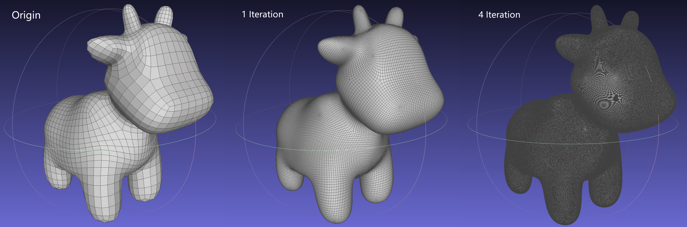

# Edge-Friend-Loader


本仓库为论文 《Edge-Friend: Fast and Deterministic Catmull-Clark Subdivision Surfaces》的 dx12 管线复现，[论文链接](https://diglib.eg.org/handle/10.1111/cgf14863)，[官方 CPU 实现与 HLSL](https://github.com/Bloodwyn/edgefriend-supplemental)。

项目包含：
- **DX12 版本**：使用 DX12 + 官方的 GPU Compute Shader 执行细分。
- **C++ 版本**：官方的 CPU 细分实现，用于结果校验。

## Build

在项目根目录执行：

```powershell
cmake -S . -B build "-DCMAKE_POLICY_VERSION_MINIMUM=3.5"
cmake --build build --config Release
```

## Run

运行：

```powershell
.\build\Release\edgefriend_demo.exe
```

运行并比较 DX12 与 C++ 输出是否一致：

```powershell
.\build\Release\edgefriend_demo.exe --check
# 可选
.\build\Release\edgefriend_demo.exe --check --eps 1e-5
```


